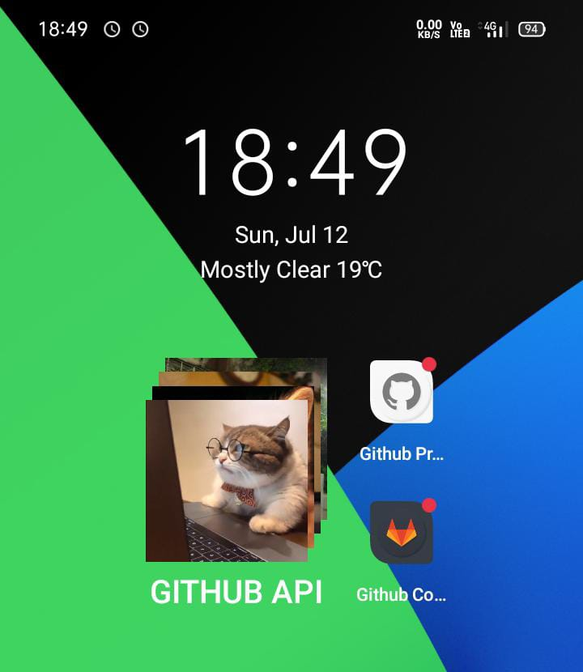
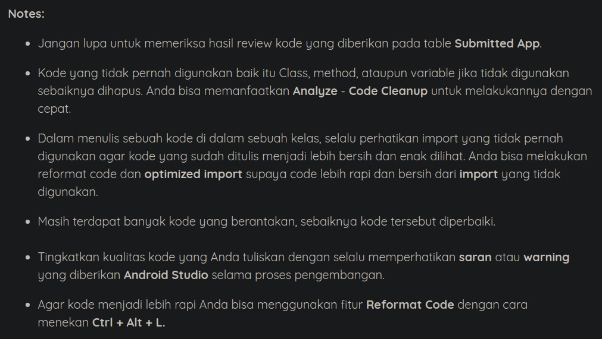

# AndroidFundamental-Sub3
Please use as a reference guys  
* Repeating Alarm
* Notification with Panding Intent
* Share data to other apps with Content Provider
* Stack Widget
* SQLite

# Notes

# Link Download Apps
### Github Provider
http://www.mediafire.com/file/pcjlfnkeuhmfkk1/Github_Provider.apk/file
### Github Consumer
http://www.mediafire.com/file/violxiugqcvclxb/Github_Consumer.apk/file

